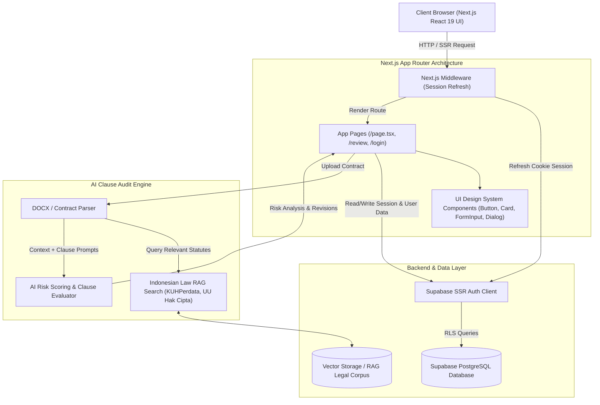

# System Design Documentation - Klarisa Platform

## 1. Overview & Product Vision

**Klarisa** is an AI-powered LegalTech SaaS platform designed specifically for freelancers, SMBs (UMKM), content creators, and contract workers in Indonesia.

- **Tagline**: *"Legal Clarity, Without the Legal Desk"*
- **Core Value Proposition**: Automates contract risk identification, maps problematic clauses to relevant Indonesian statutory laws (e.g., KUHPerdata, UU Hak Cipta, UU Perlindungan Konsumen), and proposes balanced revision drafts before contract execution.

---

## 2. Technology Stack & Framework Architecture

| Layer | Technology | Key Details & Version |
| :--- | :--- | :--- |
| **Frontend Framework** | Next.js 16 (App Router) + React 19 | Server Components, Client Components, Actions, Edge/Node Runtime |
| **Language** | TypeScript 5 | Strict mode, End-to-end type safety |
| **Styling & Theme** | Tailwind CSS v4 + CVA + CSS Modules | `@import "tailwindcss"`, `class-variance-authority`, OKLCH design tokens |
| **UI Components** | Shadcn UI Primitives + Radix UI | `@radix-ui/react-dialog`, `@radix-ui/react-dropdown-menu`, `@radix-ui/react-slot` |
| **Icons & Media** | Lucide React | `lucide-react` modern line icon set |
| **Authentication & DB** | Supabase SSR (`@supabase/ssr`) | Supabase PostgreSQL, RLS policies, Cookie-based SSR Auth Middleware |
| **AI / RAG Pipeline** | Vector Database + LLM Engine | Contract text parsing, Vector embeddings against Indonesian Legal Code |

---

## 3. System Architecture & Component Diagram



---

## 4. Key Subsystems & Workflows

### 4.1 Authentication & Middleware Flow
- **Supabase SSR**: Session state is managed via secure HTTP-only cookies processed by `src/middleware.ts` calling `updateSession()`.
- **Row Level Security (RLS)**: Enforces document and project isolation per authenticated user ID at the database level.

### 4.2 Document Audit & RAG Pipeline
1. **Contract Ingestion**: Client uploads a DOCX / PDF contract.
2. **Text Parsing & Clause Extraction**: File contents are parsed into discrete clauses (e.g., Payment Terms, Termination, IP Ownership).
3. **Retrieval-Augmented Generation (RAG)**: Each clause is converted to vector embeddings and matched against the **Indonesian Positive Law Corpus** (KUHPerdata Art. 1338, UU Hak Cipta, UU Perlindungan Konsumen).
4. **Risk Classification**:
   - 🔴 **High Risk**: Unbalanced indemnities, open-ended payment delays, unfair unilateral termination.
   - 🟡 **Medium Risk**: Ambiguous scope definitions, vague acceptance criteria.
   - 🟢 **Fair / Standard**: Standard legal boilerplate clauses.
5. **Balanced Revision Proposal**: Generates fair replacement draft text that protects user interests while remaining acceptable to counter-parties.

### 4.3 Unified Collaboration & Workspace
- **Review Canvas**: Side-by-side view displaying the original contract document (`doc-paper` design token) alongside flagged risk cards.
- **Drafting & Threads**: Interactive draft builder allowing users to convert negotiated items directly into revised contract clauses.

---

## 5. UI/UX Design System & Tokens

### 5.1 Color Palette

```
   ┌─────────────────────────────────────────────────────────────┐
   │ Deep Ink Surface (Navy/Dark):  #0F172A / #0B0F17            │
   │ Primary Brand Blue:           #0284C7 / #2F5BD3             │
   │ Danger / Risk Accent:          #DC2626 / #A6383E             │
   │ Warning / Caution:             #D97706                       │
   │ Soft Tint Background:          #DCE5FF / #EEF1F5             │
   └─────────────────────────────────────────────────────────────┘
```

- **Primary Brand Color**: `#0284C7` (Sky Blue) & `#2F5BD3` (Royal Blue) - Conveys trust, legal clarity, and technology.
- **Dark Surface**: `#0F172A` / `#0B0F17` - Sleek slate background for risk cards, navigation, and security sections.
- **High Risk Accent**: `#DC2626` / `#A6383E` - Visual indicator for flagged ambiguous or dangerous contract terms.
- **Document Surface**: `#FFFFFF` with serif typography (`doc-paper`) simulating real printed legal paper.

### 5.2 Typography System

- **Headings**: `Plus Jakarta Sans` (`--font-jakarta`) - Clean geometric sans-serif for high visual impact.
- **Body & Controls**: `DM Sans` / `Inter` (`--font-sans`) - Exceptional legibility for user interface controls and body text.
- **Document Paper View**: `Times New Roman` / Serif (`--font-doc`) - Mimics standard legal contract document typography.
- **Code & Placeholders**: Monospace (`--font-mono`) - Formatted placeholders and structured contract variables.

---

## 6. Directory & Code Base Layout

```
klarisa/
├── src/
│   ├── app/
│   │   ├── globals.css         # Tailwind v4 configuration & theme tokens
│   │   ├── layout.tsx          # Root app layout with font providers
│   │   ├── page.tsx            # Landing page & platform feature overview
│   │   └── page.module.css     # Responsive CSS module styling for landing
│   ├── components/
│   │   ├── ui/                 # Shadcn UI primitives (Button, Card, Dialog, Badge, Input)
│   │   └── submit-button.tsx   # Async submit button component
│   ├── lib/
│   │   ├── utils.ts            # Class merging utility (clsx + tailwind-merge)
│   │   └── supabase/           # Supabase SSR client, server, and middleware helpers
│   ├── repositories/           # Data access repository layer (DB abstraction)
│   ├── services/               # Business logic & AI audit service integrations
│   ├── types/                  # TypeScript interface definitions
│   └── middleware.ts           # Next.js global route middleware
├── DESIGN.md                   # System design documentation
├── tailwind.config.ts          # Tailwind theme extensions
└── package.json                # Project dependencies & scripts
```

---

## 7. Scalability & Security Considerations

- **Zero Document File Retention**: Contracts are parsed ephemerally for vector processing and risk evaluation without long-term unencrypted file storage.
- **Statutory Traceability**: Every AI warning links directly to specific Indonesian civil law articles, eliminating hallucinated legal opinions.
- **Component Architecture**: Decoupled repository (`src/repositories/`) and service (`src/services/`) layers allow swapping LLM providers or vector databases without refactoring UI components.
