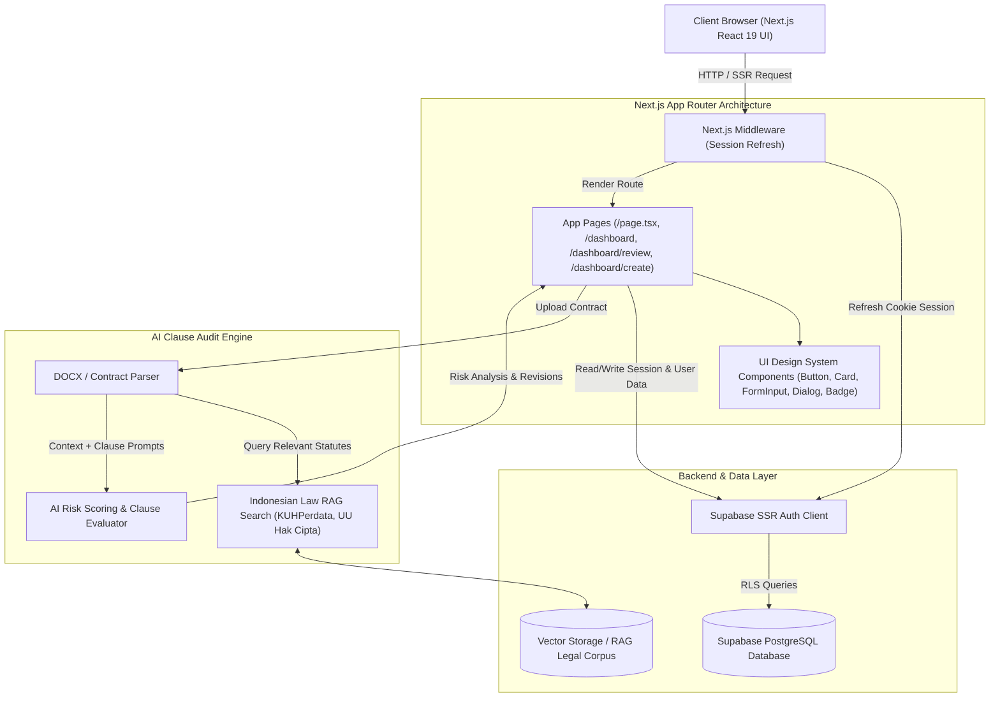

# System Design & Design System Documentation - Klarisa Platform

## 1. Overview & Product Vision

**Klarisa** is an AI-powered LegalTech SaaS platform designed specifically for freelancers, SMBs (UMKM), content creators, and contract workers in Indonesia.

- **Tagline**: *"Legal Clarity, Without the Legal Desk"*
- **Core Value Proposition**: Automates contract risk identification, maps problematic clauses to relevant Indonesian statutory laws (e.g., KUHPerdata, UU Hak Cipta, UU Perlindungan Konsumen), and proposes balanced revision drafts before contract execution.

---

## 2. Technology Stack & Framework Architecture

| Layer | Technology | Key Details & Version |
| :--- | :--- | :--- |
| **Frontend Framework** | Next.js 16 (App Router) + React 19 | Server Components, Client Components, Actions, Edge/Node Runtime |
| **Language** | TypeScript 5 | Strict mode, End-to-end type safety |
| **Styling & Theme** | Tailwind CSS v4 + CVA + CSS Modules | `@import "tailwindcss"`, `@theme`, `class-variance-authority`, OKLCH & HEX tokens |
| **UI Components** | Shadcn UI Primitives + Radix UI | `@radix-ui/react-dialog`, `@radix-ui/react-dropdown-menu`, `@radix-ui/react-slot` |
| **Icons & Media** | Lucide React | `lucide-react` modern line icon set |
| **Authentication & DB** | Supabase SSR (`@supabase/ssr`) | Supabase PostgreSQL, RLS policies, Cookie-based SSR Auth Middleware |
| **AI / RAG Pipeline** | Vector Database + LLM Engine | Contract text parsing, Vector embeddings against Indonesian Legal Code |

---

## 3. System Architecture & Component Diagram



---

## 4. Key Subsystems & Workflows

### 4.1 Authentication & Middleware Flow
- **Supabase SSR**: Session state is managed via secure HTTP-only cookies processed by `src/middleware.ts` calling `updateSession()`.
- **Row Level Security (RLS)**: Enforces document and project isolation per authenticated user ID at the database level.

### 4.2 Document Audit & RAG Pipeline
1. **Contract Ingestion**: Client uploads a DOCX / PDF contract (`ReviewUploader`).
2. **Text Parsing & Clause Extraction**: File contents are parsed into discrete clauses (e.g., Payment Terms, Termination, IP Ownership).
3. **Retrieval-Augmented Generation (RAG)**: Each clause is converted to vector embeddings and matched against the **Indonesian Positive Law Corpus** (KUHPerdata Art. 1338, UU Hak Cipta, UU Perlindungan Konsumen).
4. **Risk Classification**:
   - 🔴 **High Risk / High Severity**: Unbalanced indemnities, open-ended payment delays, unfair unilateral termination (`.clause-issue`, `#DC2626`).
   - 🟡 **Medium Risk / Caution**: Ambiguous scope definitions, vague acceptance criteria (`#D97706` / `text-orange-500`).
5. **Balanced Revision Proposal**: Generates fair replacement draft text that protects user interests while remaining acceptable to counter-parties (`✦ REKOMENDASI REDAKSI`).

### 4.3 Unified Collaboration & Workspace
- **Review Canvas**: Side-by-side view displaying the original contract document (`.doc-paper` design token) alongside flagged risk cards.
- **Drafting & Threads**: Interactive draft builder (`DraftEditor`) allowing users to convert negotiated items directly into revised contract clauses.

---

## 5. UI/UX Design System & Tokens (`src/app/globals.css`)

### 5.1 Color Tokens & Visual System

```
┌───────────────────────────────────────────────────────────────────────────┐
│ Deep Ink Surface (Navy/Dark):  #0F172A / #172031 / #0B0F17 (Dark BG)     │
│ Primary Brand Blue:           #0284C7 / #2F5BD3 (Royal Blue Accent)       │
│ Soft Light Blue Tints:        #edf2ff / #eaf0ff / #f3f6ff                  │
│ Danger / Risk Accent:          #DC2626 (Red 600) / text-red-700 / bg-red-50 │
│ Warning / Legal Context:       #D97706 (Amber 600) / text-orange-500       │
│ Success / Standard Term:       #16A34A (Green 600)                        │
│ Document Paper Background:     #FFFFFF (Light) / #0F172A (Dark)           │
│ App Surface Background:        #f7f8fb (Dashboard Slate)                  │
└───────────────────────────────────────────────────────────────────────────┘
```

#### Token Color Definitions:
- **`--color-klarisa-primary` (`#0F172A` / `#172031`)**: Deep ink slate navy. Used for main headers, dark card backgrounds ("BERIKUTNYA"), primary call-to-action buttons, and sidebar text.
- **`--color-klarisa-secondary` (`#2F5BD3`)**: Royal blue accent color. Used for active navigation links, eyebrow headers, link hover states, icon accents, and focused borders.
- **`--color-klarisa-tertiary` (`#FF4A18`)**: Coral orange accent used for callouts and highlight badges.
- **Risk Severity Scale**:
  - **High Risk**: `#DC2626` (Border & Icon), `bg-red-50` (Background tint), `text-red-700` / `text-[#991B1B]` (Text).
  - **Medium Risk**: `#D97706` / `text-orange-500`, `border-orange-500`, `bg-red-50`.
  - **Low Risk / Safe**: `#16A34A` (Green success indicator).
- **Surface Shades**:
  - `--background`: `oklch(1 0 0)` (Light Mode) / `oklch(0.145 0 0)` (Dark Mode).
  - Dashboard Base: `#f7f8fb` (Subtle off-white slate background).
  - Panel Backgrounds: `#f8fafc` / `#f6f8fc` (Discussion panels & stepper background).

---

### 5.2 Typography Hierarchy System

The platform relies on a 4-tier font family architecture defined via CSS variables:

| Font Role | Font Family | Variable / Class | Target Application |
| :--- | :--- | :--- | :--- |
| **Headings & Display** | `Plus Jakarta Sans` | `var(--font-jakarta)` / `font-heading` | Page titles, hero sections, card headings, section titles |
| **Body & UI Controls** | `DM Sans` / `Inter` | `var(--font-dm)` / `font-sans` | Controls, buttons, input fields, navigation items, descriptive text |
| **Legal Document Paper** | `Times New Roman` / Serif | `var(--font-doc)` / `font-serif` / `.doc-paper` | Contract text viewer, printed contract simulation, clause paragraphs |
| **Code & Variables** | Monospace | `var(--font-mono)` / `.clause-placeholder` | Clause placeholder badges, code snippets, structured contract inputs |

#### Typography Patterns:
- **Eyebrow Header**: `text-[9px] font-bold tracking-[0.18em] text-klarisa-secondary` (UPPERCASE) — Used consistently across all dashboard sections and cards (`DOKUMEN KERJA`, `TEMUAN DALAM KONTEKS`, `CATATAN UNTUK PASAL 02`, `DISKUSI DOKUMEN`).
- **Hero Display Title**: `font-heading text-[clamp(2.75rem,5vw,4.4rem)] font-normal leading-[.95] tracking-[-.06em]`.
- **Card Section Title**: `font-heading text-2xl font-normal tracking-[-.04em]`.
- **Document Title**: `font-heading text-2xl font-semibold leading-tight sm:text-3xl`.

---

### 5.3 Custom CSS Utilities (`src/app/globals.css`)

1. **`.doc-paper`**:
   - Simulates physical legal paper.
   - Styling: `font-family: "Times New Roman", Times, serif`, `font-size: 1rem`, `line-height: 1.75`, `background-color: #FFFFFF`, `border: 1px solid var(--border)`, `border-radius: 0.5rem`.
   - Dark mode override: `background-color: #0F172A`, `border-color: #1E293B`.
2. **`.clause-issue`**:
   - Highlights risky or flagged contract text within documents.
   - Styling: `background-color: rgba(220, 38, 38, 0.10)`, `border-bottom: 2px solid #DC2626`, `color: #991B1B`, `border-radius: 0.25rem`, `padding: 0.125rem 0.375rem`.
   - Dark mode text: `#FCA5A5`.
3. **`.clause-placeholder`**:
   - Renders editable variable fields within draft contracts (e.g. `[Nama Pihak]`, `[Nilai Imbalan]`).
   - Styling: `font-family: var(--font-mono)`, `border: 1px dashed #CBD5E1`, `background-color: #F1F5F9`, `color: #334155`.
   - Dark mode: `border-color: #334155`, `background-color: #1E293B`, `color: #E2E8F0`.

---

## 6. UI Component Library & Architecture

### 6.1 Primitives Layer (`src/components/ui/`)

- **`Button` (`src/components/ui/button.tsx`)**:
  - Built using `class-variance-authority` (CVA).
  - **Variants**: `default` (Slate primary), `secondary`, `outline`, `ghost`, `destructive`, `blue` (`bg-klarisa-secondary text-white`), `link`.
  - **Sizes**: `default` (`h-11 px-4`), `xs` (`h-8 px-2.5`), `sm` (`h-9 px-3`), `lg` (`h-12 px-6`), `icon`, `icon-xs`, `icon-sm`, `icon-lg`.
  - **`SubmitButton` (`src/components/ui/submit-button.tsx`)**: Extended button with automatic loading spinner and `useFormStatus` support.
- **`Card` (`src/components/ui/card.tsx`)**:
  - Modular composite container (`CardHeader`, `CardTitle`, `CardDescription`, `CardAction`, `CardContent`, `CardFooter`).
  - Adapts to dark/light theme automatically with `--card-spacing: --spacing(4)` or `--spacing(3)`.
- **`Badge` (`src/components/ui/badge.tsx`)**:
  - Variants: `default`, `secondary`, `destructive`, `outline`, `ghost`. Used for status pills and risk indicators.
- **`FormInput` & `Input` (`src/components/ui/form-input.tsx`)**:
  - Includes label, floating helper text, validation error messaging, and `aria-invalid` styling for Zod validation errors.
- **`Dialog` (`src/components/ui/dialog.tsx`)**:
  - Radix UI modal wrapper. Includes custom max-height rule `height: min(720px, calc(100svh - 2rem))` for version history modals.

---

### 6.2 Domain-Specific Component System (`src/components/`)

| Component | Responsibility & Design Features |
| :--- | :--- |
| **`DashboardShell`** | Workspace shell layout featuring a `216px` fixed desktop sidebar, collapsible mobile drawer, active navigation link highlighting (`bg-[#eaf0ff] text-klarisa-secondary`), user profile badge with initials avatar, brand header, and search trigger. |
| **`ContractDocument` & `SourceSentence`** | Legal document viewer (`max-w-[620px]`). Displays contract clauses on `.doc-paper` with interactive sentence buttons (`SourceSentence`) linked via `aria-pressed` state to corresponding risk cards. |
| **`FindingList`** | Categorized contract findings list. Displays legal context badges (e.g. `KUHPerdata Pasal 1338`), risk analysis, sentence scroll triggers, and redline revision suggestions (`✦ REKOMENDASI REDAKSI`). |
| **`DraftEditor`** | Full-featured contract drafting editor. Supports version history browsing, diff visualization, clause locking/unlocking, variable placeholder insertion, and auto-saving indicator. |
| **`DraftDiscussionThread` / `DiscussionPanel`** | Sidebar panel for document discussions. Displays threaded comments per clause, user avatar pills, question input, and source-clause references. |
| **`ReviewUploader`** | DOCX upload dropzone featuring a 3-step onboarding flow (`01 Validasi`, `02 Temukan`, `03 Bahas`), sample document preview card, security assurance badge (`ShieldCheck`), and loading skeleton transition (`DashboardSkeleton`). |
| **`ContractSearchClient` & `SharedDraftsClient`** | Filterable document data tables and grids with empty states, category tags, search inputs, and action menus. |

---

## 7. Page Layout Archetypes & Screen Structure

### 7.1 Landing Page Layout (`src/app/page.tsx`)
- **Header**: Sticky glassmorphism header (`backdrop-blur bg-white/90 border-b border-slate-900/10 h-18`).
- **Hero Section**: Eyebrow label (`text-klarisa-secondary`), bold display heading, double CTA (`Review Kontrak` blue button & `Buat Kontrak`), interactive hero preview (`HomeWorkspacePreview`).
- **Feature Sections**: 3-step numbered workflow cards (`01`, `02`, `03`), audience targeting tags (`Freelancer`, `UMKM`, `Kreator`, `Pekerja Kontrak`), interactive AI assistant demo (`HomeChatbot`).
- **Footer**: Brand mark, copyright notice, legal disclaimer.

### 7.2 Auth Layout (`src/app/(auth)/login` & `register`)
- **Structure**: Centered split card layout on soft background (`#f7f8fb`).
- **Header**: Centered Klarisa logo mark and headline.
- **Form Card**: White rounded card containing social OAuth button (Google icon component), divider, `FormInput` fields, submit button with loading state, and helper links.

### 7.3 Dashboard Home Layout (`src/app/dashboard/page.tsx`)
- **Hero Banner**: Personal greeting ("Selamat datang, [Nama]"), eyebrow `WORKSPACE PRIBADI`, quick actions (`CreateDraftButton`, `FileSearch`).
- **Metrics Grid**: 3-column stats card (`DOKUMEN AKTIF`, `BAGIAN UNTUK DIBAHAS`, `DISKUSI TERBUKA`) with large display numbers (`text-4xl font-heading`).
- **Main Grid**:
  - **Left (65%)**: Active documents list with numerical index (`01`, `02`), updated time, status text, and hover state (`hover:bg-slate-50`).
  - **Right (35%)**: High-priority "BERIKUTNYA" dark slate card (`bg-[#172031] text-white`) highlighting urgent action items.
  - **Secondary Row**: Activity timeline grid and light blue note card (`bg-[#eaf0ff] border-[#d9e0ea]`).

### 7.4 Review & Audit Canvas (`src/app/dashboard/review/*`)
- **Document Header**: Sticky top bar showing contract title, status pill ("3 bagian perlu ditinjau"), and parsed text metadata.
- **Dual-Pane View**:
  - **Left Pane**: Original contract paper view (`ContractDocument`) rendered on `.doc-paper` with highlighted source sentences.
  - **Right Pane**: Interactive audit analysis (`FindingList`) showing selected clause findings, RAG statute references, and redline revision suggestions, or the discussion drawer (`DiscussionPanel`).

### 7.5 Draft Editor Canvas (`src/app/dashboard/create/page.tsx`)
- **Top Toolbar**: Document title editor, status indicator, action buttons (Version History, Share, Export DOCX).
- **Editor Workspace**: Centered paper workspace (`DraftEditor`) with real-time editing, placeholder variables, clause diff viewer, and floating discussion sidebar toggle.

---

## 8. Interactive States, Micro-interactions & Accessibility

### 8.1 State Management Conventions
- **Active Selection**: Selected sentences and navigation items use `aria-pressed="true"` or active class triggers (`border-l-klarisa-secondary bg-[#f3f6ff]`).
- **Validation Errors**: Form inputs apply `aria-invalid="true"` rendering a red border (`border-destructive`) and message.
- **Disabled State**: Action buttons enforce `disabled:opacity-50 pointer-events-none`.
- **Loading & Skeleton States**: Asynchronous actions display `DashboardSkeleton` or `SubmitButton` with an animated spinner (`animate-spin`).

### 8.2 Micro-Interactions & Scrollbar System
- **Custom Slate Scrollbar**: Defined globally in `globals.css` (`width: 4px`, thumb `#94a3b8` transitioning to `#2f5bd3` on hover).
- **Smooth Auto-Scroll**: Clicking a finding card automatically scrolls the corresponding `SourceSentence` into view (`scrollIntoView({ behavior: "smooth", block: "center" })`).
- **Backdrop Blur**: Sticky headers and mobile drawers utilize `backdrop-blur` for smooth visual depth.

---

## 9. Directory & Code Base Layout

```
klarisa/
├── src/
│   ├── app/
│   │   ├── (auth)/             # Auth route group (login, register)
│   │   ├── actions/            # Server actions
│   │   ├── dashboard/          # Protected workspace routes
│   │   │   ├── create/         # Contract draft editor page
│   │   │   ├── review/         # Contract audit & findings pages
│   │   │   ├── search/         # Document search page
│   │   │   ├── shared/         # Shared drafts page
│   │   │   ├── layout.tsx      # Dashboard layout wrapper with DashboardShell
│   │   │   └── page.tsx        # Dashboard home overview
│   │   ├── validations/        # Zod validation schemas
│   │   ├── globals.css         # Tailwind v4 theme & custom utilities
│   │   ├── layout.tsx          # App root layout with font setup
│   │   └── page.tsx            # Platform landing page
│   ├── components/
│   │   ├── ui/                 # Shadcn UI primitives (Button, Card, Dialog, Badge, Input, FormInput)
│   │   ├── contract-review-components.tsx # Document viewer & finding list
│   │   ├── dashboard-shell.tsx  # Workspace sidebar & top header shell
│   │   ├── draft-editor.tsx     # Contract drafting canvas & diff editor
│   │   ├── draft-discussion-thread.tsx # Real-time discussion panel
│   │   ├── review-uploader.tsx  # DOCX uploader & step-by-step flow
│   │   └── home-chatbot.tsx     # Landing page interactive AI demo widget
│   ├── lib/
│   │   ├── utils.ts            # Class merging helper (clsx + tailwind-merge)
│   │   └── supabase/           # SSR Supabase client, server, and middleware
│   ├── repositories/           # Supabase data access layer
│   ├── services/               # Business logic & AI audit services
│   ├── types/                  # TypeScript interface definitions
│   └── middleware.ts           # Next.js global route middleware
├── DESIGN.md                   # System design & design system documentation
├── tailwind.config.ts          # Tailwind CSS configuration extensions
└── package.json                # Project dependencies
```

---

## 10. Scalability & Security Considerations

- **Zero Document File Retention**: Contracts are parsed ephemerally for vector processing and risk evaluation without long-term unencrypted file storage.
- **Statutory Traceability**: Every AI warning links directly to specific Indonesian civil law articles (KUHPerdata, UU Hak Cipta), eliminating hallucinated legal opinions.
- **Component Architecture**: Decoupled repository (`src/repositories/`) and service (`src/services/`) layers allow swapping LLM providers or vector databases without refactoring UI components.
